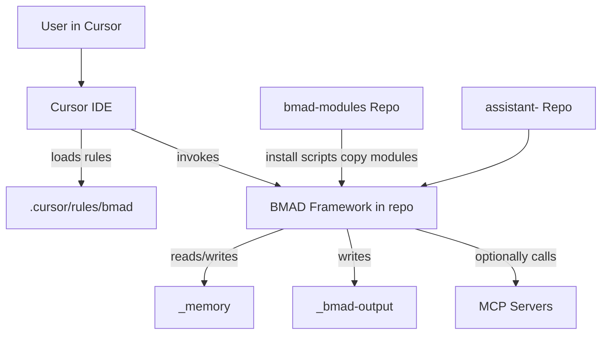

# Architecture: Vixxo Personal AI Assistant (BMAD + Cursor)

## Purpose

This repository is an example of the Vixxo “personal assistant” pattern:

- **Cursor** is the primary orchestrator/interface.
- **BMAD** provides a structured framework for agents, workflows, templates, rules, and memory patterns.
- **GitHub** is the sharing and persistence layer for reusable modules (and optionally for personal assistant repos).

This doc summarizes the architecture decisions and conventions we established while building the first shared capability pack (`vixxo-shared`) and the per-person assistant template flow.

## High-Level Architecture

## Repo Roles

### Per-person assistant repos

Pattern: `assistant-<name>` (example: `assistant-will-olson`)

Responsibilities:

- Personal memory and context: `_memory/`
- Generated artifacts: `_bmad-output/`
- Installed Vixxo modules: `_bmad/vixxo-*/`
- Cursor rules for discoverability: `.cursor/rules/bmad/`

### `vixxo-copilot/bmad-modules`

Source-of-truth for reusable modules (e.g., `vixxo-shared`).

Installed into assistant repos via authenticated `gh`-based installers:

- macOS/Linux: `scripts/install-module.sh`
- Windows: `scripts/install-module.ps1`

### `vixxo-copilot/assistants-template`

The GitHub template used to create per-person assistant repos.

It includes bootstrap scripts (`scripts/bootstrap.sh` and `scripts/bootstrap.ps1`) that install `vixxo-shared` and set up minimal Cursor rule scaffolding.

## Key BMAD Concepts Used

- **Agents**: personas with a menu of actions/workflows (e.g., Ally / `one-on-one`)
- **Workflows**: step-by-step processes (e.g., `prepare-1on1`)
- **Templates**: markdown templates to standardize outputs and memory records
- **Memory / sidecars**: persisted context files in `_memory/` (contacts, 1:1 sidecars)
- **Cursor rules (`.mdc`)**: make agents/workflows discoverable and easy to invoke from Cursor

## Module Example: `vixxo-shared`

`vixxo-shared` is our first “shared capability pack,” designed to be installed into any assistant repo.

It provides:

- **Agent**: `one-on-one` (“Ally”)
- **Workflows**:
  - `prepare-1on1`: generates both a personal prep doc and an email-friendly bullet agenda
  - `post-1on1`: minimal capture workflow (initial implementation)
- **Memory schema**:
  - Contacts: `_memory/contacts/*.md`
  - Sidecars: `_memory/1on1-sidecars/*-1on1.md`

## Installation & Updates (Current State)

### Installing modules into an assistant repo

Because `bmad-modules` is private, installs require `gh auth login` and use `gh repo clone`.

On install/update, the module is copied into `_bmad/<module-code>/` and Cursor rules are copied into `.cursor/rules/bmad/<module-code>/`.

### Updating modules

Current strategy is “install again”:

- Re-run bootstrap or the module installer script
- Restart Cursor so it re-indexes rules

We intentionally deferred “prune” behavior (cleaning up renamed/removed modules) to a later enhancement.

## External Integrations (Planned)

BMAD itself is file-centric. For richer automation we plan to use:

- **MCP servers** for Gmail/Calendar/Linear/Slack integrations
- **Tool calls** from Cursor to external systems as needed

## Known Limitations (v1)

- Assistants are per-repo/per-person contexts; there is no built-in cross-user agent messaging.
- File-based sharing via GitHub is the current distribution mechanism.

## Conventions

- **Assistant repos**: `assistant-<name>`
- **Internal module codes**: `vixxo-*`
- **IDs**: kebab-case and stable; display names can change without breaking installs

